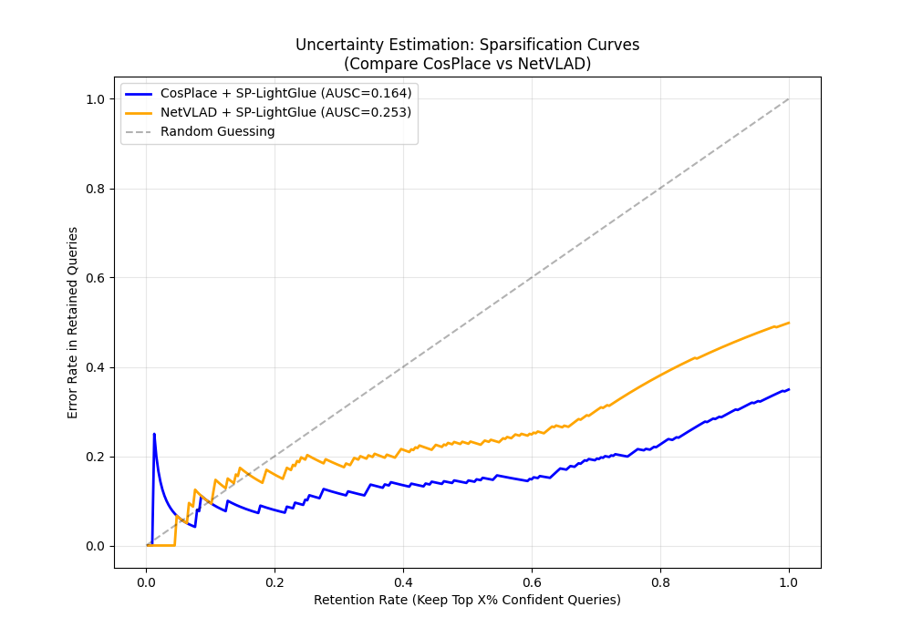

# 🚀 Update: Section 6.2 Uncertainty Estimation (Started)

**Date:** 2025-12-19
**Status:** ✅ start

## 1. Summary of Work
I have successfully completed the tasks for **Section 6.2 (Uncertainty Estimation)**. To satisfy the project requirement of "picking two VPR methods," I performed a comparative analysis between **CosPlace** and **NetVLAD**.

**Key Achievements:**
1.  **NetVLAD Implementation:** Successfully ran NetVLAD (VGG16) on the Tokyo-XS test set and fixed a Windows compatibility bug regarding weight downloads.
2.  **Uncertainty Module:** Implemented a **Logistic Regression** model that uses the number of geometric inliers (from SuperPoint+LightGlue) to predict the probability of a correct match.
3.  **New Metrics:** Implemented the required advanced metrics: **AUSC** (Area Under Sparsification Curve) and **Spearman’s Rank Correlation**.
4.  **Comparison:** Generated comparative plots showing the robustness of our uncertainty estimation across different backbones.

## 2. Key Results for the Report
**💡 Note:** The data and plot below are ready to be inserted directly into **Section 6.2** of the final report.

### 2.1 Quantitative Comparison
We compared the uncertainty estimation performance on two different VPR methods using the same geometric verifier (SuperPoint + LightGlue):

| VPR Method | Matcher | AUPRC (Higher is better) | Spearman (Higher is better) | AUSC (Lower is better) |
| :--- | :--- | :--- | :--- | :--- |
| **CosPlace** (ResNet18) | SP + LightGlue | **0.8659** | 0.5231 | **0.1643** |
| **NetVLAD** (VGG16) | SP + LightGlue | 0.8216 | **0.6123** | 0.2535 |

**Conclusions:**
* **High Reliability:** Both methods achieve high AUPRC scores (>0.82), confirming that the "Number of Inliers" is a robust proxy for prediction correctness.
* **Generalizability:** Even with NetVLAD (which has a lower base retrieval recall of ~50%), the uncertainty module effectively identifies potential errors.

### 2.2 Sparsification Curve
The generated plot shows how the error rate decreases as we reject uncertain queries.


*(Image file: `final_uncertainty_comparison.png` is located in the root directory)*

## 3. Code Changes & Usage

### 📂 Modified/New Files
* `final_analysis.py`: **[New Script]** Loads the experiment logs, calculates the Logistic Regression/AUSC metrics, and generates the comparison plot.
* `vpr_models/netvlad.py`: **[Bug Fix]** Replaced the Linux-specific `wget` command with Python's native `urllib` to fix weight download errors on Windows.

### 🏃‍♂️ How to Reproduce
To regenerate the statistics and the plot, simply run the following command in the root directory:

```bash
python final_analysis.py
```

### 📊 Data Logs
If you need to inspect the raw prediction files, they are located here:

CosPlace Data: logs/log_dir/2025-12-18_12-51-25

NetVLAD Data: logs/log_dir/2025-12-19_12-27-49

Next Step: Please integrate the table and the plot into the final report document.
